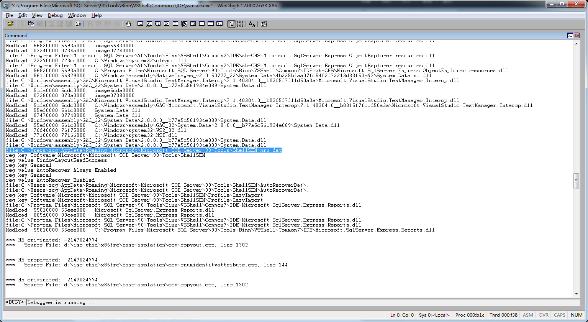
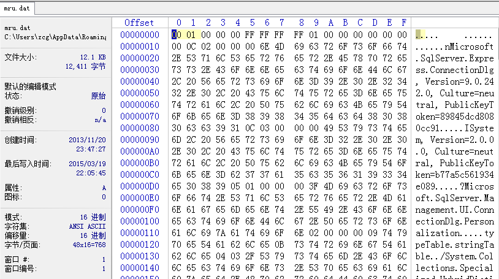
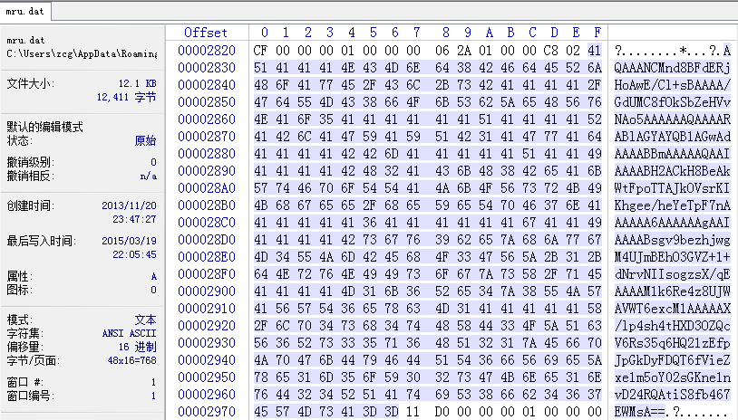
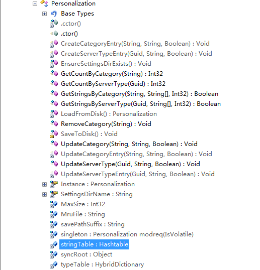
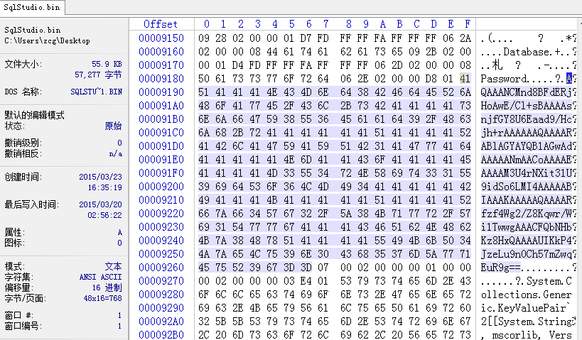
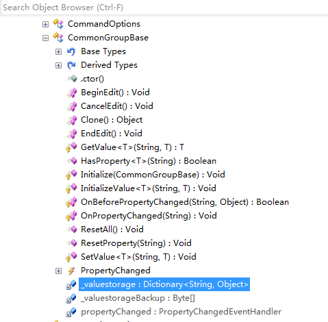

# SQL Server Management Studio密码导出工具
在windows下保存密码无非就是两个位置：注册表和文件。于是用windbg打开查询分析器(版本为SQL Server Management Studio 2005 Express)，下几个条件断点：
```
bp kernel32!CreateFileW ".printf \"file:%mu\\n\",poi(@esp+4);g;"
bp advapi32!RegCreateKeyExW ".printf \"reg key:%mu\\n\",poi(@esp+8);g;"
bp advapi32!RegSetValueExW ".printf \"reg value:%mu\\n\",poi(@esp+8);g;"
```
执行查询分析器，登录一个服务器，勾选记住密码，然后退出。可以看到windbg输出了很多信息：


依次查看这些文件和注册表，发现mru.dat十分可疑：


可以看出，这个文件是一个标准的.net二进制序列化文件，其中有一段可疑的base64：


解密后为乱码，鉴于windows上绝大部分的可逆加密都是dpapi，于是直接用dpapi进行解密：
```
Console.WriteLine(Encoding.Unicode.GetString(System.Security.Cryptography.ProtectedData.Unprotect(Convert.FromBase64String("AQAAANCMnd8BFdERjHoAwE/Cl+sBAAAA/GdUMC8fOkSbZeHVvNAo5AAAAAAQAAAARABlAGYAYQB1AGwAdAAAABBmAAAAAQAAIAAAABH2ACkH8BeAkWtFpoTTAJkOVsrKIKhgee/heYeTpF7nAAAAAA6AAAAAAgAAIAAAABsgv9bezhjwgM4UJmBEhO3GVZ+1+dNrvNIIsogzsX/qEAAAAM1k6Re4z8UJWAVWT6excM1AAAAAX/lp4sh4tHXD3OZQcV6Rs35q6HQ21zEfpJpGkDyFDQT6fVieZxe1m5oY02sGKne1nvD24RQAtiS8fb467EWMsA=="),null,System.Security.Cryptography.DataProtectionScope.LocalMachine)));
```

其结果果然为所记住的密码，基本可确定此文件就是所需文件。
由于sql server登录时服务器、用户名、密码缺一不可，于是需要对这个文件进行进一步解析才能得到其对应关系。既然是二进制序列化，那么可以用以下代码进行反序列化：
```
static object DeserializeFile(string path)
{
  using(MemoryStream mem=new MemoryStream(File.ReadAllBytes(path)))
  {
    mem.Position=0;
    BinaryFormatter bf=new BinaryFormatter();
    return bf.Deserialize(mem);
  }
}
```
执行后抛出一个异常：
```
System.Runtime.Serialization.SerializationException: 无法找到程序集“Microsoft.SqlServer.Express.ConnectionDlg, Version=9.0.242.0, Culture=neutral, PublicKeyToken=89845dcd8080cc91”。
```
显然这个序列化对象是其私有程序集中自定义的结构，私有程序集大多时候都保存在主程序目录下，查看安装目录果然看到了这个程序集。鉴于可能需要加载很多私有程序集，于是注册以下回调，使得在程序集缺失的情况下自动加载依赖项：
```
static Assembly LoadDependsAssemblies(object sender, ResolveEventArgs args)
{
  try
  {
    string dllpath=@"C:\Program Files\Microsoft SQL Server\90\Tools\Binn\VSShell\Common7\IDE\"+new AssemblyName(args.Name).Name+".dll";
    Assembly asm=Assembly.LoadFile(dllpath);
    return asm;
  }catch{Console.WriteLine(args.Name);Environment.Exit(-1);}
  return null;
}
```
再次进行反序列化，反序列化成功，得到了一个[Microsoft.SqlServer.Express.ConnectionDlg]Microsoft.SqlServer.Management.UI.ConnectionDlg.Personalization类型的实例。
用reflector打开此程序集，可以看到其内部实例字段为两个字典：typeTable和stringTable:

用反射取出这两个字段的值，并依次对其进行遍历，在stringTable中得到了以下结果：
```
(省略)
8c91a03d-f9b4-46c0-a305-b5dcc79ff907@192.168.223.250\SQLEXPRESS@1@sa@Password       :Microsoft.SqlServer.Management.UI.ConnectionDlg.StringList
8c91a03d-f9b4-46c0-a305-b5dcc79ff907@192.168.223.250\SQLEXPRESS@1@sa@ET             :Microsoft.SqlServer.Management.UI.ConnectionDlg.StringList
(省略)
```
很明显，stringTable的键以@为分隔符保存了数据库名称和用户的信息，最后的ET、Password等则是一个字段名称标记。以Password结尾的键所对应的值是一个[Microsoft.SqlServer.Express.ConnectionDlg]Microsoft.SqlServer.Management.UI.ConnectionDlg.StringList的实例，这个类型实现了IEnumerable接口，于是可以获取其枚举器并进行遍历：
```
IEnumerable data=stringTable[k] as IEnumerable;
if(data!=null)
{
  IEnumerator ie=data.GetEnumerator();
  while(ie.MoveNext())
  {
    Console.WriteLine(ie.Current.ToString());
  }
}
```
最终得到了最开始获取的那段base64，解密后就是原始的密码，结合键名即可获取到完整的登录信息。

从SQL2008开始，其储存方式又有了区别，首先到%appdata%\Microsoft\Microsoft SQL Server目录下查找.net序列化的文件，发现SqlStudio.bin非常可疑：

依前法解密这一长串base64，发现与保存的密码相同，基本可确定此文件就是所需文件。
于是对其进行反序列化，得到了一个[Microsoft.SqlServer.Management.UserSettings]Microsoft.SqlServer.Management.UserSettings.SqlStudio类型的实例。这个类型本身没有实例字段，于是查看其基类[Microsoft.SqlServer.Management.UserSettings]Microsoft.SqlServer.Management.UserSettings.CommonGroupBase，可看到其内部使用了字典_valuestorage保存数据:

对字典进行遍历，发现其键名为SqlStudio类中定义的常量SSMS_PROPERTY_KEY的值SSMS，其键值类型为[Microsoft.SqlServer.Management.UserSettings]Microsoft.SqlServer.Management.UserSettings.SSMS。继续跟踪SSMS类型，发现其同样继承自CommonGroupBase，并且定义了非常多的常量键值名称，于是可断定，这个序列化文件中保存了一个巨大的目录树。
对这个目录树逐级进行跟踪：在SSMS类中ConnectionOptions键下面保存了ConnectionOptions类型的值；ConnectionOptions类中ServerTypes键下面保存了一个字典，字典的值为ServerTypeItem类型；ServerTypeItem类中Servers键下面保存了一个列表，列表的值是ServerConnectionItem类型；ServerConnectionItem中Instance键保存了一个字符串，其值为服务器名；Connections键保存了一个列表，列表的值是ServerConnectionSettings类型；ServerConnectionSettings中UserName和Password保存了两个字符串，这就是最终要获取的信息。以上结果以树状图表示大致如下：
```
SqlStudio
└─SSMS
    └─ConnectionOptions
        ├─ServerTypes-1
        │  ├─Servers-1
        │  │  │  Instance
        │  │  │
        │  │  ├─Connections-1
        │  │  │      Password
        │  │  │      UserName
        │  │  │
        │  │  └─Connections-2
        │  │          Password
        │  │          UserName
        │  │
        │  └─Servers-2
        │      │  Instance
        │      │
        │      └─Connections-1
        │              Password
        │              UserName
        │
        └─ServerTypes-2
            ├─Servers-1
            │  │  Instance
            │  │
            │  ├─Connections-1
            │  │      Password
            │  │      UserName
            │  │
            │  └─Connections-2
            │          Password
            │          UserName
            │
            └─Servers-2
                │  Instance
                │
                └─Connections-1
                        Password
                        UserName
```
知道了保存方式，接下来只要遍历就能取到结果了。需要注意的是由于其列表和字典都是其自定义类，要用其实现的接口IDictionary和IEnumerable进行操作，其伪代码大致为：
```
foreach ServerType in SqlStudio['SSMS']['ConnectionOptions']['ServerTypes']
{
  foreach Server in ServerType['Servers']
  {
    print Server.Instance
    foreach Connection in Server['Connections']
    {
      print Connection.UserName,Connection.Password
    }
  }
}
```
更高版本的序列化文件结构与SSMS2008并无任何区别，但由于其依赖版本改为了.net 4.0，所以必须要用.net4.0编译才能成功反序列化。


附件中SSMSPwd-20.exe与SSMSPwd-40.exe为编译好的程序，分别用.net 2.0和.net 4.0编译，使用方法如下：
>SSMSPwd.exe
```
#显示所有保存信息，无论是否保存了密码
SSMSPwd.exe -a
#解密指定的文件
SSMSPwd.exe -f c:\SqlStudio.bin -p "c:\Program Files\Microsoft SQL Server\110\Tools\Binn\ManagementStudio\" 
```
SSMSPwd.cs为工具源码，编译命令行：
>csc SSMSPwd.cs

注意版本高于2008的SSMS必须使用.net 4.0提供的csc进行编译。

已知错误信息：
    Password: (dec err : 该项不适于在指定状态下使用。)
用户不匹配，需要切换到指定用户执行此程序

